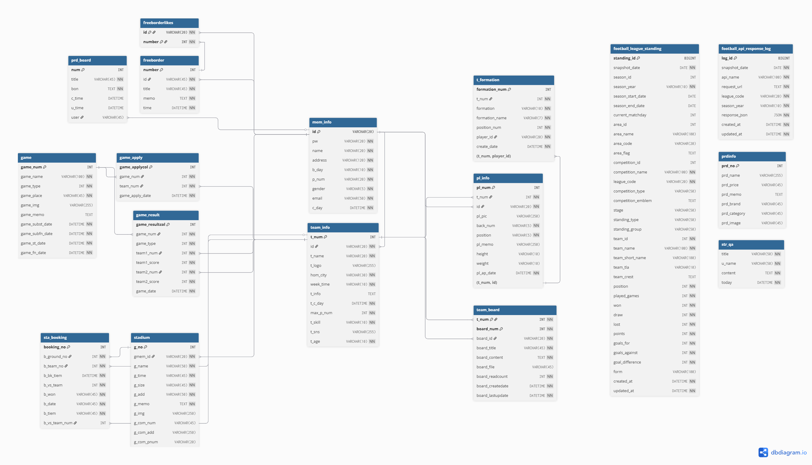

# FCJAVA_Project

축구팀 관리, 축구장 예약, 대회 신청, 상품 조회, 게시판, 팀 채팅 기능을 제공하는 Java 기반 웹 프로젝트입니다.

## 프로젝트 구성

이 저장소는 Eclipse Dynamic Web Project와 별도 Node.js 채팅 서버로 구성되어 있습니다.

```text
FCJAVA_Project/
├── FCJAVA/                 # Eclipse Dynamic Web Project
│   ├── src/                # Java Servlet, Action, Service, DAO, DTO, MyBatis mapper
│   └── WebContent/         # JSP, CSS, JavaScript, 이미지, WEB-INF
├── chat-server/            # Socket.IO 기반 팀 채팅 서버
├── docs/                   # DB DDL, ERD 등 프로젝트 문서
│   ├── erd/
│   └── sql/
├── README.md
├── .gitattributes
└── .gitignore
```

## 주요 기능

- 회원가입 및 로그인
- 자유게시판 작성, 수정, 삭제, 좋아요
- 축구팀 생성, 검색, 가입, 탈퇴
- 팀 상세 페이지
  - 선수 목록 및 선수 정보
  - 팀 일정
  - 대회 결과
  - 포메이션 관리
  - 팀 게시판
  - 팀 채팅
- 축구장 등록, 조회, 예약
- 대회 목록, 검색, 상세 조회, 참가 신청 및 취소
- 상품 목록 및 상세 조회

## 기술 스택

- Java 8
- Servlet/JSP
- MyBatis
- MySQL
- JSTL, Gson, Lombok
- HTML/CSS/JavaScript, Bootstrap, jQuery UI
- Node.js, Express, Socket.IO

## Eclipse 실행 방법

1. Eclipse에서 `File > Import > Existing Projects into Workspace`를 선택합니다.
2. `Select root directory`에 저장소 루트가 아니라 `FCJAVA_Project/FCJAVA`를 선택합니다.
3. Dynamic Web Project로 import한 뒤 Target Runtime에 Tomcat을 연결합니다.
4. `FCJAVA/WebContent/WEB-INF/lib`에 있는 JAR들이 Build Path에 포함되어 있는지 확인합니다.
5. Tomcat에서 프로젝트를 실행합니다.

기본 웹 context root는 `FCJAVA`입니다.

```text
http://localhost:8080/FCJAVA
```

## 채팅 서버 실행 방법

팀 채팅은 Java 웹앱과 별도로 `chat-server`에서 실행합니다.

```bash
cd chat-server
npm install
npm start
```

채팅 서버 기본 포트는 `3000`입니다.

```text
http://localhost:3000
```

Java 웹앱은 기본적으로 `http://localhost:8080`에서 접근한다고 가정합니다. 포트가 다르면 `chat-server/server.js`의 `CLIENT_URL` 값을 수정해야 합니다.

## DB 설정

MyBatis 설정과 SQL mapper는 `FCJAVA/src/com/fcjava/xml` 아래에 있습니다.

- `mybatis-config.xml`: DB 연결 및 mapper 등록
- `game-mapper.xml`, `team-mapper.xml` 등: 기능별 SQL

DB 접속 정보는 개발 환경에 맞게 수정해야 합니다.

DB 스키마와 ERD 산출물은 `docs` 아래에서 관리합니다.

- `docs/sql/DDL.sql`: 전체 테이블 DDL 및 PK, FK, UK 제약조건
- `docs/erd/ERD.png`: 포트폴리오용 ERD 이미지
- `docs/erd/ERD.pdf`: ERD PDF 문서



주요 테이블 관계는 다음과 같습니다.

- `mem_info`: 회원 기준 테이블
- `team_info`: 팀 정보, 팀 생성 회원을 `mem_info.id`로 참조
- `pl_info`: 팀 소속 선수 정보, `team_info.t_num`과 `mem_info.id` 참조
- `game_apply`: 대회 참가 신청, `game.game_num`과 `team_info.t_num` 참조
- `game_result`: 대회 결과, 대회와 참가 팀을 참조
- `stadium`, `sta_booking`: 경기장 등록 회원, 예약 경기장, 예약 팀 참조
- `freeborder`, `freeborderlikes`, `team_board`, `prd_board`: 게시글 작성자와 좋아요 대상 참조
- `t_formation`: 팀 포메이션의 선수 배치를 `pl_info(t_num, id)`로 참조

## Git 관리 기준

다음 파일은 저장소에서 제외합니다.

- Eclipse 빌드 산출물: `FCJAVA/build/`, `FCJAVA/bin/`, `*.class`
- Node 의존성: `node_modules/`
- 로컬 환경 파일: `.env`, `.env.*`
- IDE 개인 설정: `.idea/`, `.vscode/`, Eclipse 로컬 메타데이터
- 로그, 임시 파일, OS 생성 파일

`chat-server/package.json`과 `package-lock.json`은 커밋하고, `chat-server/node_modules`는 커밋하지 않습니다.
